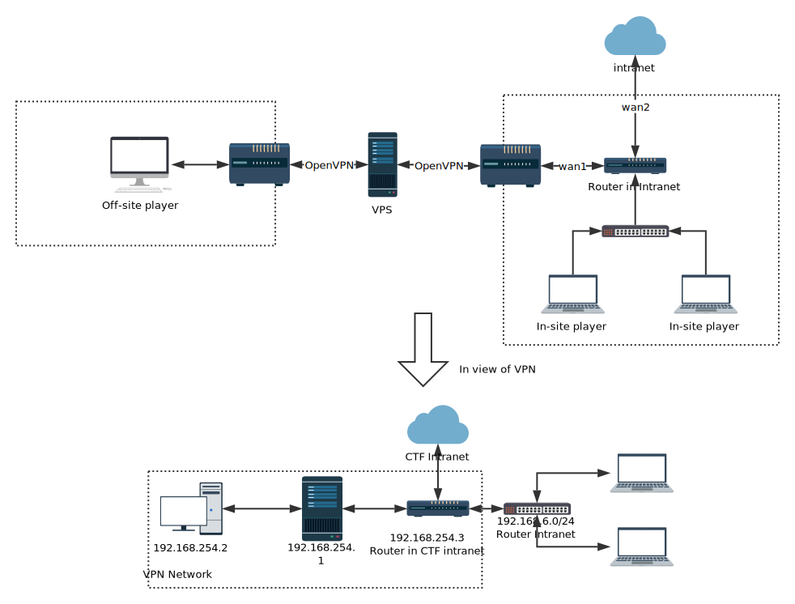

# OpenVPN for CTF

This is a OpenVPN server used in CTF offline match, this docker allow players in 
the external network accessing the game intranet without barriers.

#### Upstream Links
* GitHub @ [kylemanna/docker-openvpn](https://github.com/kylemanna/docker-openvpn)

## Quick Start

### Configure VPS

> should be accessable from both the on-site players and the off-site players

1. export some variables:
1. just run `make init` and follow the command-line prompts
1. boot up with `make start` or `docker-compose up -d`

> the variables to be exported are:

|name|description|
|-|-|
|HOST|your vps's IP address|
|PORT|some spare port on your vps|
|NETWORK_ID/MASK|on-site challenge network|

>The input format of the NETWORK_ID/MASK:  
>       NETWORK_ID is 192.168.1.0 and MASK is 255.255.255.0 if the game's running under 192.168.1.*

### Configure On-site Router

>a raspi, maybe?
1. download the generated `router.ovpn` on the vps
1. run the script `router.sh`, look into it before running!

### ~~Configure~~ Off-site Clients

1. download the generated `player.ovpn` on the vps
1. drop the file into a OpenVPN client and start H@ck1ng

## Next Steps

### Network topology

### More Reading

Miscellaneous write-ups for advanced configurations are available in the
[docs](docs) folder.

### Systemd Init Scripts

A `systemd` init script is available to manage the OpenVPN container.  It will
start the container on system boot, restart the container if it exits
unexpectedly, and pull updates from Docker Hub to keep itself up to date.

Please refer to the [systemd documentation](docs/systemd.md) to learn more.

## Debugging Tips

* Create an environment variable with the name DEBUG and value of 1 to enable debug output (using "docker -e").

        docker run -v $OVPN_DATA:/etc/openvpn -p 1194:1194/udp --privileged -e DEBUG=1 ctf_vpn_docker

* Test using a client that has openvpn installed correctly

        $ openvpn --config CLIENTNAME.ovpn

* Run through a barrage of debugging checks on the client if things don't just work (run in the docker)

        $ ping 192.168.255.1 # checks if you can connect to the VPN server
        $ ping ${CTF_SUBNET} # checks if you can connect to the CTF subnet

* Consider setting up a [systemd service](/docs/systemd.md) for automatic
  start-up at boot time and restart in the event the OpenVPN daemon or Docker
  crashes.

## How Does It Work?

Initialize the volume container using the `kylemanna/openvpn` image with the
included scripts to automatically generate:

- Diffie-Hellman parameters
- a private key
- a self-certificate matching the private key for the OpenVPN server
- an EasyRSA CA key and certificate
- a TLS auth key from HMAC security

The OpenVPN server is started with the default run cmd of `ovpn_run`

The configuration is located in `/etc/openvpn`, and the Dockerfile
declares that directory as a volume. It means that you can start another
container with the `-v` argument, and access the configuration.
The volume also holds the PKI keys and certs so that it could be backed up.

To generate a client certificate, `kylemanna/openvpn` uses EasyRSA via the
`easyrsa` command in the container's path.  The `EASYRSA_*` environmental
variables place the PKI CA under `/etc/openvpn/pki`.

Conveniently, `kylemanna/openvpn` comes with a script called `ovpn_getclient`,
which dumps an inline OpenVPN client configuration file.  This single file can
then be given to a client for access to the VPN.

To enable Two Factor Authentication for clients (a.k.a. OTP) see [this document](/docs/otp.md).

## OpenVPN Details

We use `tun` mode, because it works on the widest range of devices.
`tap` mode, for instance, does not work on Android, except if the device
is rooted.

The topology used is `net30`, because it works on the widest range of OS.
`p2p`, for instance, does not work on Windows.

The UDP server uses`192.168.255.0/24` for dynamic clients by default.

The client profile specifies `redirect-gateway def1`, meaning that after
establishing the VPN connection, all traffic will go through the VPN.
This might cause problems if you use local DNS recursors which are not
directly reachable, since you will try to reach them through the VPN
and they might not answer to you. If that happens, use public DNS
resolvers like those of Google (8.8.4.4 and 8.8.8.8) or OpenDNS
(208.67.222.222 and 208.67.220.220).

## Security Discussion

The Docker container runs its own EasyRSA PKI Certificate Authority.  This was
chosen as a good way to compromise on security and convenience.  The container
runs under the assumption that the OpenVPN container is running on a secure
host, that is to say that an adversary does not have access to the PKI files
under `/etc/openvpn/pki`.  This is a fairly reasonable compromise because if an
adversary had access to these files, the adversary could manipulate the
function of the OpenVPN server itself (sniff packets, create a new PKI CA, MITM
packets, etc).

* The certificate authority key is kept in the container by default for
  simplicity.  It's highly recommended to secure the CA key with some
  passphrase to protect against a filesystem compromise.  A more secure system
  would put the EasyRSA PKI CA on an offline system (can use the same Docker
  image and the script [`ovpn_copy_server_files`](/docs/paranoid.md) to accomplish this).
* It would be impossible for an adversary to sign bad or forged certificates
  without first cracking the key's passphase should the adversary have root
  access to the filesystem.
* The EasyRSA `build-client-full` command will generate and leave keys on the
  server, again possible to compromise and steal the keys.  The keys generated
  need to be signed by the CA which the user hopefully configured with a passphrase
  as described above.
* Assuming the rest of the Docker container's filesystem is secure, TLS + PKI
  security should prevent any malicious host from using the VPN.

## Benefits of Running Inside a Docker Container

### The Entire Daemon and Dependencies are in the Docker Image

This means that it will function correctly (after Docker itself is setup) on
all distributions Linux distributions such as: Ubuntu, Arch, Debian, Fedora,
etc.  Furthermore, an old stable server can run a bleeding edge OpenVPN server
without having to install/muck with library dependencies (i.e. run latest
OpenVPN with latest OpenSSL on Ubuntu 12.04 LTS).

### It Doesn't Stomp All Over the Server's Filesystem

Everything for the Docker container is contained in two images: the ephemeral
run time image (kylemanna/openvpn) and the `$OVPN_DATA` data volume. To remove
it, remove the corresponding containers, `$OVPN_DATA` data volume and Docker
image and it's completely removed.  This also makes it easier to run multiple
servers since each lives in the bubble of the container (of course multiple IPs
or separate ports are needed to communicate with the world).

### Some (arguable) Security Benefits

At the simplest level compromising the container may prevent additional
compromise of the server.  There are many arguments surrounding this, but the
take away is that it certainly makes it more difficult to break out of the
container.  People are actively working on Linux containers to make this more
of a guarantee in the future.

## License

